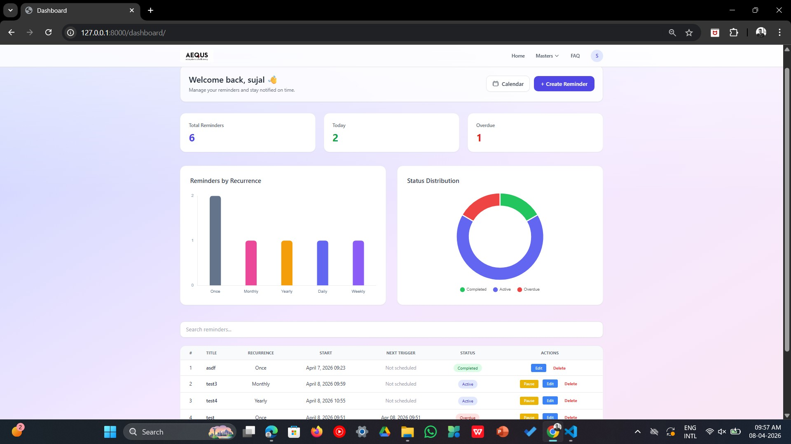
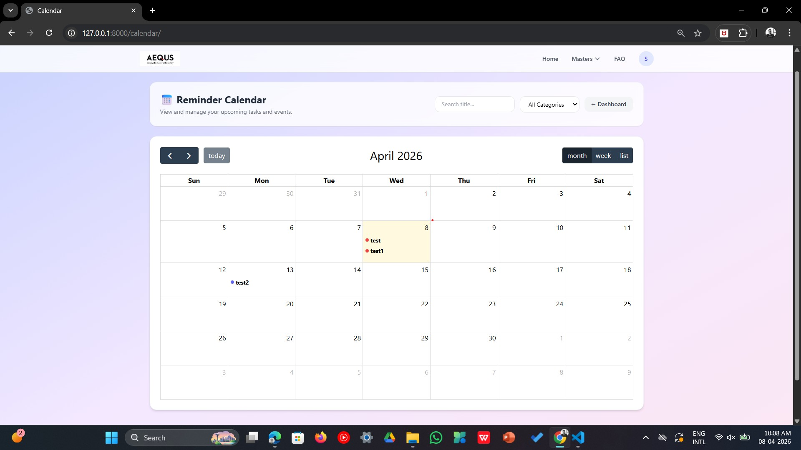

# 🚀 AEQUS Reminder Management System

An enterprise-grade, full-stack automated workflow and notification platform built with **Django** and **Microsoft SQL Server**. This system decouples web-based task scheduling from background email dispatching to provide a highly secure, autonomous, and fault-tolerant reminder infrastructure.

---

## ✨ Key Features

- 🔐 **Role-Based Access Control (RBAC):** Cryptographically isolated workspaces for Standard Users, alongside a global Management Console for Administrators.
- ⏱️ **Advanced Recurrence Engine:** Support for complex scheduling rules including One-Time, Daily, Weekly, Monthly, and Yearly executions with dynamic next-date calculation.
- ⚙️ **Decoupled Background Orchestration:** Utilizes Windows Task Scheduler and batch scripting to evaluate temporal triggers and dispatch emails completely independent of active web sessions.
- 🛡️ **Proactive MIME Security:** Deep binary header inspection on all file attachments. Enforces a strict 20MB limit and actively strips malicious executables (e.g., `.exe`, `.bat`).
- 📊 **Analytical Dashboard:** Real-time operational observability using dynamic JS-rendered Pie Charts (Status Distribution) and Bar Graphs (Recurrence Patterns).
- 📅 **Interactive Status Calendar:** A dynamic monthly grid mapping tasks to color-coded health statuses (Completed, Active, Notified, Paused, Overdue) with asynchronous event summary modals.
- 🗄️ **Admin Master Consoles:** Dedicated modules for User Management, Category Master (custom tags and hex colors), FAQ Master, and internal Fault/Activity Logging.
- 🛑 **Fault Tolerance:** Graceful exception handling for SMTP network timeouts to prevent execution loop crashes.

---

## 🛠️ Technology Stack

**Frontend:**
- HTML5 & CSS3
- JavaScript (ES6)
- Bootstrap 5 (Responsive Mobile-First Architecture)
- Chart.js / FullCalendar.js (Data Visualization)

**Backend & Automation:**
- Python 3.8+
- Django 4.x (MVT Architecture)
- Windows Task Scheduler & `start_scheduler.bat` (Background Execution)
- Python `smtplib` & `email.mime` (SMTP Network Protocols)

**Database:**
- Microsoft SQL Server
- `pyodbc` (Database Driver)
- Django ORM

---

## 📸 System Previews


| Dashboard Analytics | Interactive Calendar |
| :---: | :---: |
|  |  |

| Task Creation (Recurrence) | Category Master (Admin) |
| :---: | :---: |
|  |  |

---

## 🚀 Installation & Setup

### 1. Prerequisites

Before you begin, ensure you have the following installed:

- Python 3.8 or higher
- Microsoft SQL Server (local or remote)
- [ODBC Driver 17 (or newer) for SQL Server](https://learn.microsoft.com/en-us/sql/connect/odbc/download-odbc-driver-for-sql-server)
- An active SMTP email account (e.g., Gmail with App Passwords, or a corporate Exchange server)

### 2. Clone the Repository

```bash
git clone https://github.com/sujal-7k7/Reminder-Tool.git
cd Reminder-Tool/Reminder-main
```

### 3. Create & Activate a Virtual Environment

```bash
python -m venv venv

# Windows
venv\Scripts\activate
```

### 4. Install Dependencies

```bash
pip install -r requirements.txt
```

### 5. Configure Environment Variables

Create a `.env` file inside `Reminder-main/` and populate it with your credentials:

```env
# Django
SECRET_KEY=your-django-secret-key
DEBUG=True

# Database
DB_NAME=your_database_name
DB_SERVER=your_sql_server_host
DB_USER=your_db_username
DB_PASSWORD=your_db_password

# Email (SMTP)
EMAIL_HOST=smtp.gmail.com
EMAIL_PORT=587
EMAIL_HOST_USER=your_email@gmail.com
EMAIL_HOST_PASSWORD=your_app_password
```

> ⚠️ **Never commit your `.env` file.** It is already listed in `.gitignore`.

### 6. Apply Database Migrations

```bash
python manage.py makemigrations
python manage.py migrate
```

### 7. Create a Superuser (Admin Account)

```bash
python manage.py createsuperuser
```

### 8. Run the Development Server

```bash
python manage.py runserver
```

Visit `http://127.0.0.1:8000` in your browser.

---

## ⚙️ Background Scheduler Setup (Windows Task Scheduler)

The email dispatch engine runs independently via `start_scheduler.bat` and Windows Task Scheduler.

1. Locate `start_scheduler.bat` in the `Reminder-main/` folder.
2. Open **Task Scheduler** → **Create a Basic Task**.
3. Set the trigger to your desired frequency (e.g., every 5 minutes).
4. Set the action to run `start_scheduler.bat`.
5. Ensure the task is set to run whether or not the user is logged in.

The scheduler internally calls `run_scheduler.py`, which triggers the Django management command `check_reminder` to evaluate and dispatch due reminders.

---

## 📁 Project Structure

```
Reminder-Tool/
├── README.md
│
└── Reminder-main/                  # Project root
    ├── manage.py
    ├── requirements.txt
    ├── run_scheduler.py            # Scheduler entry point (called by .bat)
    ├── start_scheduler.bat         # Windows Task Scheduler trigger
    ├── .gitignore
    │
    ├── reminder_app/               # Core Django application
    │   ├── models.py               # Database models
    │   ├── views.py                # Request handlers
    │   ├── urls.py                 # URL routing
    │   ├── forms.py                # Django forms
    │   ├── admin.py                # Admin panel config
    │   ├── middleware.py           # Custom middleware
    │   ├── recurrence.py           # Recurrence engine logic
    │   ├── scheduler.py            # Email dispatch logic
    │   ├── utils.py                # Helper utilities
    │   ├── apps.py
    │   ├── tests.py
    │   ├── migrations/             # Database migration files
    │   └── management/
    │       └── commands/
    │           └── check_reminder.py   # Management command for scheduler
    │
    ├── logs/                       # Auto-generated runtime logs
    │   ├── activity/               # Daily activity logs
    │   └── errors/                 # Daily error logs
    │
    ├── media/                      # User-uploaded files
    │   └── attachments/
    │       └── user_<id>/          # Per-user attachment storage
    │
    └── Database_Backup/            # SQL Server backup files (.bak)
```

---

## 🤝 Contributing

Contributions, issues, and feature requests are welcome. Please open an issue first to discuss what you'd like to change.

---

## 📄 License

This project is licensed under the [MIT License](LICENSE).
